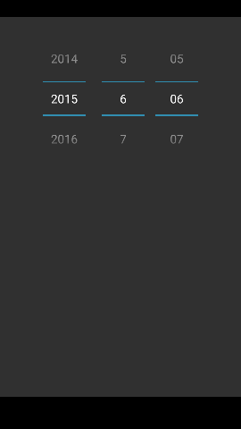
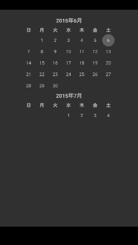
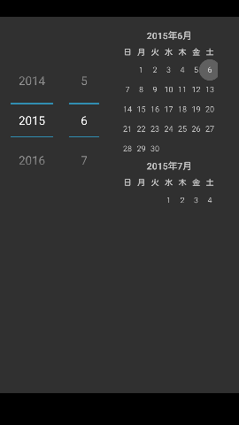
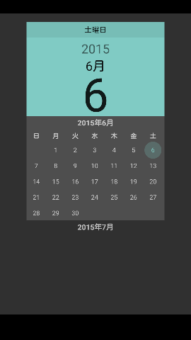

Android-DatePicker-Sample
====

このリポジトリは、
DatePicker の表示形式が boolean で定義されているために
Lollipop (API Level 21) で追加された表示形式に対応できなくなった
(属性を増やすことで無理やり対応した)
Android らしさを感じていただくために用意されたリポジトリです。

## Description
### 属性
|属性|API Level|
|---|---|
|`android:calendarViewShown="true|false"`|11|
|`android:spinnersShown="true|false"`|11|
|`android:datePickerMode="spinner|calendar"`|21|

### 各属性を設定した場合の表示の違い

||DatePickerPattern1|DatePickerPattern2|DatePickerPattern3|DatePickerPattern4|DatePickerPattern5|DatePickerPattern6|DatePickerPattern7|DatePickerPattern8|
|---|---|---|---|---|---|---|---|---|---|---|---|---|---|---|---|---|
|`android:datePickerMode`|spinner|spinner|spinner|spinner|calendar|calendar|calendar|calendar|
|`android:calendarViewShown`|false|false|true|true|false|false|true|true|
|`android:spinnersShown`|false|true|false|true|false|true|false|true|
|Screenshot|||||||||

## Licence

    Copyright 2015 wada811

    Licensed under the Apache License, Version 2.0 (the "License");
    you may not use this file except in compliance with the License.
    You may obtain a copy of the License at

    http://www.apache.org/licenses/LICENSE-2.0

    Unless required by applicable law or agreed to in writing, software
    distributed under the License is distributed on an "AS IS" BASIS,
    WITHOUT WARRANTIES OR CONDITIONS OF ANY KIND, either express or implied.
    See the License for the specific language governing permissions and
    limitations under the License.

## Author

[wada811](https://github.com/wada811)